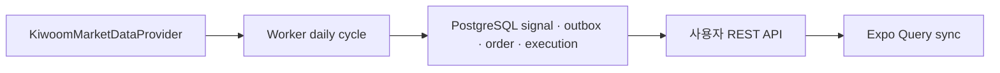
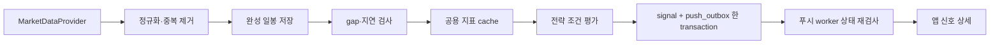
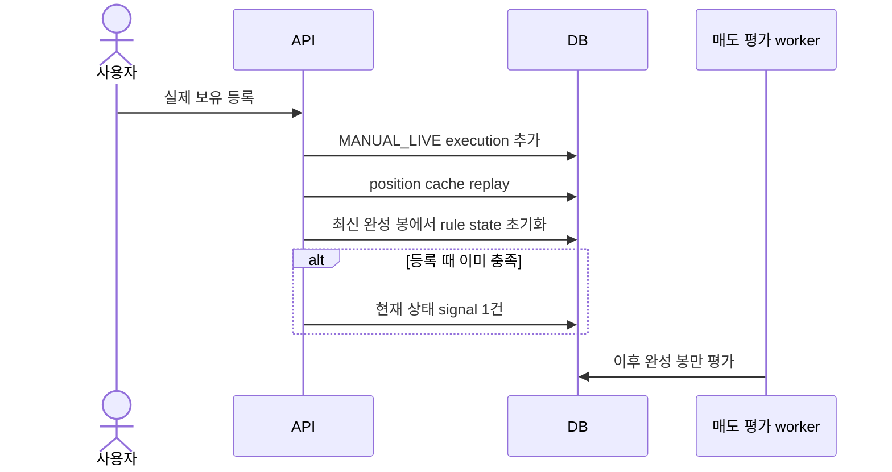
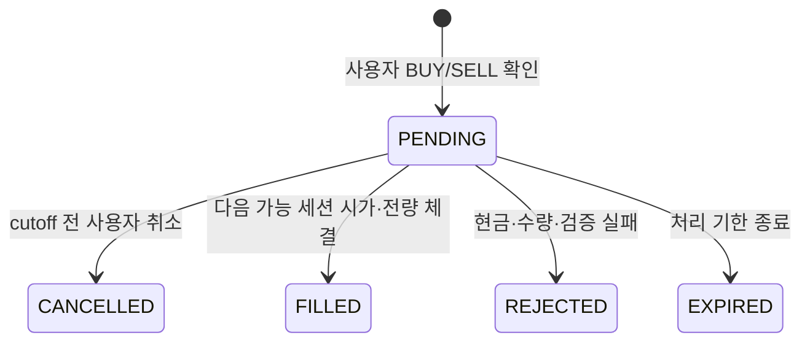
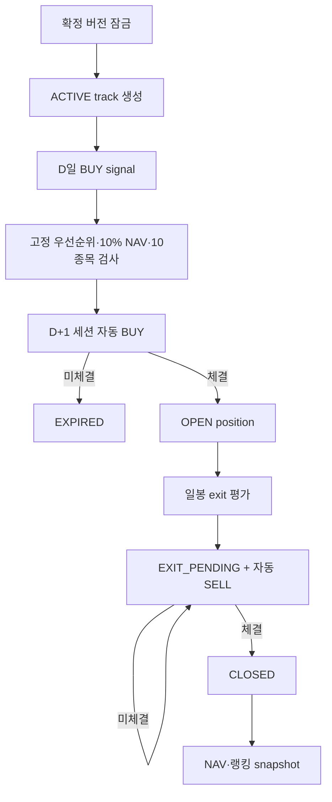
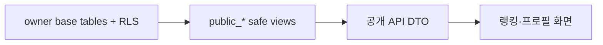

# 데이터 흐름

구현 상태: Supabase Auth, PostgreSQL API repository, Worker DB 신호/outbox·페이퍼 체결 경로가 연결됐다. 시세 provider는 키움 OpenAPI REST 일봉 adapter부터 시작한다. Mock은 test/dev fixture다. 원격 push 흐름은 아직 목표 운영 흐름이다.

## 0. 현재 실전 개발 세로 흐름



키움 자격증명, IP 허용, 검증 calendar가 없으면 Worker는 신호를 만들지 않는다. outbox `PENDING`은 저장 성공이며 원격 Push 성공이 아니다.

## 1. 시세·매수 신호



순서:

1. adapter가 provider 응답을 market, symbol, KST 세션, UTC close 시각으로 정규화한다.
2. candle upsert는 provider revision과 수신 시각을 남긴다. 미완성 봉은 평가 대상이 아니다.
3. gap, 0거래량, 중복, 역순, stale 상태를 검사한다.
4. 지표 cache key는 instrument, timeframe, indicator version, params hash, dataset version이다.
5. 직전 결과가 false이고 현재 결과가 true일 때만 signal을 만든다.
6. signal과 outbox를 같은 transaction에 넣는다. dedupe index가 재시도를 흡수한다.
7. push worker는 발송 직전 취소·공개·포지션 상태를 확인한다.

## 2. 실제 수동 보유



연결 buy signal은 nullable이다. 과거 execution 등록을 허용하지만 과거 매도 알림은 만들지 않는다. 최초 등록 시점의 최신 완성 봉만 초기 상태로 쓴다.

## 3. 자유 연습 주문



1. API가 idempotency, integer qty, 가용 현금·예약 수량을 확인한다.
2. 달력 버전으로 목표 세션을 고른다. cutoff 뒤 주문은 다음 세션으로 미룬다.
3. worker가 비수정 공식 시가, 거래 가능성, fill/cost 모델을 적용한다.
4. 한 transaction에서 order event, execution, cash ledger를 추가하고 position cache를 replay한다.

## 4. 공식 랭킹



사용자 주문 선택은 없다. 같은 세션 후보는 strength, 과거 유동성, symbol 순이다. 열린 손실도 NAV에 포함한다. snapshot은 raw ledger와 모델 버전을 가리킨다.

## 5. 매도 신호

평가 대상은 `OPEN`, `PARTIALLY_CLOSED`다. `EXIT_PENDING`은 신규 조건 평가 대신 기존 ranked SELL 재시도만 한다.

```text
exit = stopLoss OR takeProfit OR trailingStop OR maxHoldingDays
       OR technicalGroup(ANY|ALL)
```

같은 봉의 match는 `signal_rule_matches` 여러 행으로 저장한다. `position_signals`는 한 행이다. 조건 지속 true는 기존 ACTIVE를 유지한다. false면 `RESOLVED_BY_CONDITION`, 재상승 시 새 행이다. CLOSED transaction은 활성 signal과 미발송 outbox를 함께 취소한다.

## 6. 공개 조회



base table 직접 조회는 owner만 허용한다. 공개 view는 닉네임, 공개 전략, 공식 ranked 성과, 허용된 execution만 선택한다. 공개 동의 false 또는 철회 시 join 조건에서 즉시 제외된다. 열린 포지션은 직전 완료 거래 세션 cutoff를 쓴다.

차단한 공개 프로필은 `community_blocks`와 `auth.uid()` 조건으로 safe view에서 빠진다. 계정 삭제는 먼저 공개 철회·세션 폐기·보존 판단을 수행한다. 최종 hard delete는 service-role 전용 `purge_user_account`가 한 transaction에서 실행한다. 일반 사용자는 이 함수를 호출할 수 없다.

## 7. 권한 조회

API는 요청마다 `effective_user_entitlements`를 읽거나 짧게 cache한다. 우선순위는 만료되지 않은 user override, free plan entitlement다. feature flag는 별도 운영 switch다. 모든 MVP feature는 free plan에서 enabled다.

## 8. 장애 복구

- provider gap: 새 신호 중단, 상태 화면·지연 경고 표시, backfill 뒤 결정적 재계산
- queue 중복: DB idempotency와 unique key로 무해화
- push 실패: outbox retry와 attempt 기록. 원 신호는 유지
- execution transaction 실패: order는 FILLED로 바꾸지 않음
- cache 불일치: execution·cash ledger replay 후 비교
- worker 재시작: 마지막 완료 cursor 뒤부터 재개
